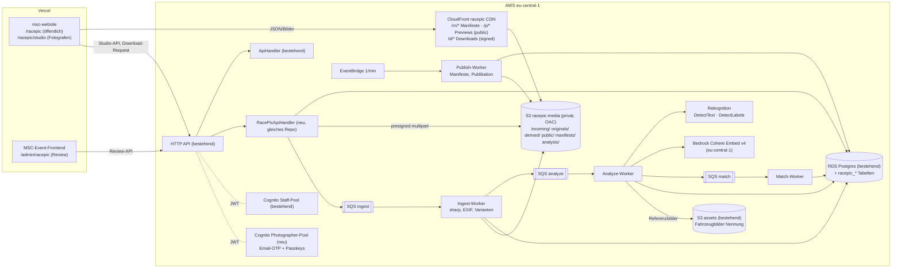
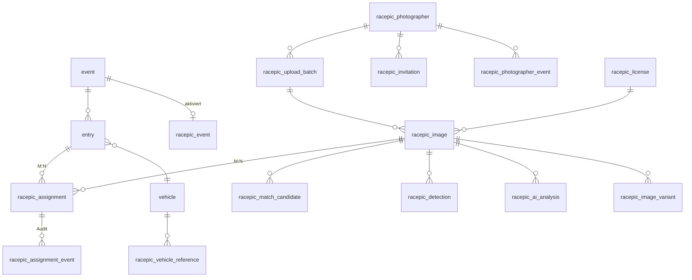

<!-- Synchron gehalten in: msc-website, MSC-Event-Backend, MSC-Event-Frontend (docs/memory-bank/racepic-architecture.md). Nur DIESE Architekturdatei wird identisch dupliziert; der Fortschritt (racepic-progress.md) ist repo-spezifisch und wird NICHT gespiegelt. -->
> **Stand:** 2026-09-25 · **Status:** Architektur freigegeben; repositoryübergreifender Reliability-/Security-Review umgesetzt, noch nicht deployed · Fortschritt in diesem Repo: [racepic-progress.md](./racepic-progress.md)

## Implementierter Ist-Stand nach Gesamt-Review (2026-09-25)

- Öffentliche Zugriffe lesen weiterhin nur validierte JSON-Manifeste und öffentliche Varianten über CloudFront; Downloads werden serverseitig gegen eine zentrale Eligibility-Regel geprüft.
- Upload-Sessions sind idempotent reserviert, an exakte Dateigröße und MIME-Type gebunden und für Single- sowie Multipart-Uploads wiederaufnehmbar. Pipeline-Schritte verwenden atomare Claims mit Leases und können vom Reconciler erneut angestoßen werden.
- Manifest-Neubauten werden in `racepic_manifest_refresh` zusammengeführt. Neue Dateien werden vor dem Entfernen veralteter Dateien geschrieben; Fehler bei Queueing oder Invalidation werden nicht mehr still verschluckt.
- `racepic_participant_suppression` verhindert nach einem Widerspruch neue KI-/manuelle Zuordnungen und entfernt bestehende aktive Zuordnungen aus Manifesten. Das Bild selbst bleibt öffentlich und herunterladbar; Bildsichtbarkeit und Bildlöschung sind davon getrennte Admin-/Fotografenentscheidungen.
- Website und Admin aktivieren RacePic nur über explizite Feature-Flags. Der öffentliche Client validiert Manifest- und Download-Antworten zur Laufzeit. Das Admin-Frontend erzwingt `racepic.read`/`racepic.manage` auch in der Navigation und Tab-Auswahl.
- Der Fotografen-Pool verwendet Refresh-Token-Rotation. Passkeys und die starke Marketplace-Step-up-Stufe bleiben bewusst spätere Ausbaustufen. Admin-MFA ist im Code vorbereitet, muss vor Produktion jedoch per Infrastrukturkonfiguration aktiviert und getestet werden.
- Die offizielle Event-Startnummer stammt ausschließlich aus der Nennung; Text auf dem Referenzfoto wird nicht als Startnummernquelle verwendet. Bei exaktem OCR-Treffer im Rennfoto werden unterdurchschnittliche Embedding-/Farbsignale des möglicherweise veralteten Referenzfotos neutral statt negativ gewertet. Überdurchschnittliche visuelle Übereinstimmung darf weiterhin helfen.

# RacePic – Architektur- und Umsetzungskonzept

## Context

RacePic soll die zentrale, eventübergreifende Bilderplattform des MSC werden. Besucher finden über `/racepic` alle Bilder ihres Fahrzeugs. Die Bilder stammen von mehreren Fotografen und werden per KI (Startnummer + Fahrzeugmerkmale) den Nennungen zugeordnet. Der erste Anwendungsfall ist das **12. Oberlausitzer Dreieck 2026**. Das Event ist bereits vorbei, die Bilder existieren also schon und der MVP wird rückwirkend befüllt.

Der MVP ist kostenlos. Das Domain-Modell muss aber einen späteren Marketplace mitdenken: bezahlte Bilder, Multi-Seller-Warenkorb, Stripe Connect, Provision und Entitlements.

Entschieden:
- Der Fotografenbereich liegt auf der Website unter `/racepic/studio`.
- Im MVP werden JPEG- und PNG-Dateien angenommen.
- Das Event liegt zurück.

**Leitentscheidung:** RacePic wird **kein neuer Service**. Es wird ein neues fachliches Modul im bestehenden **MSC-Event-Backend** (gleiches CDK, gleiche Postgres-DB, gleiche Pipeline), plus Seiten in der **msc-website** und eine Review-Oberfläche im **MSC-Event-Frontend**. Neu hinzu kommen nur Dinge, die heute technisch fehlen: ein Media-Bucket mit CloudFront, SQS-basierte Bildverarbeitung, ein Cognito-Pool für Fotografen sowie Rekognition und Bedrock.

---

## A. Ist-Analyse

| Bereich | Befund | Relevanz für RacePic |
|---|---|---|
| **Website** (`msc-website`) | Vite + React 18 + shadcn SPA auf Vercel.<br>Router: flache Liste in `src/App.tsx`, Seiten in `MainLayout`.<br>i18n in de/cz/en/pl (`src/i18n/translations.ts`).<br>TanStack Query.<br>Build-Skripte erzeugen statische OG-Seiten (`scripts/generate-*.mjs`) und die Sitemap. | Die öffentliche RacePic-Oberfläche und das Fotografen-Studio kommen hierher. |
| Website ↔ Backends | PocketBase-CMS (`src/integrations/pocketbase/client.ts`) für Inhalte.<br>Event-Backend anonym über `src/integrations/event-backend/client.ts` (`VITE_EVENT_API_BASE_URL`, Dev-Proxy in `vite.config.ts:8-25`).<br>Supabase ist ungenutzter Altbestand. | Die RacePic-API kommt vom Event-Backend und nicht vom CMS. Das CMS bleibt für redaktionelle Texte. |
| Website-Galerie | Keine eigene Lightbox-Komponente. Dialog-Lightboxes sind mehrfach dupliziert (`ImageGallerySection.tsx`, `ClassicEventPage.tsx`, `EventHubPage.tsx`). PocketBase-Bilder werden ohne Größenvarianten ausgeliefert. | Es entsteht eine neue, wiederverwendbare Galerie mit Lightbox, die später die Duplikate ersetzen kann. |
| **Nennungstool-Backend** (`MSC-Event-Backend`) | TypeScript-Monorepo (`api/`, `infra/`), CDK v2, eu-central-1, Stages dev/prod.<br>**Ein monolithischer Lambda** (`api/src/handler.ts`, ca. 5.100 Zeilen) hinter einer HTTP API (ca. 180 Routen, explizit in `infra/lib/stacks/api-stack.ts` registriert).<br>Worker per EventBridge-Schedule (E-Mail-Outbox, Privacy-Retention, EventHub).<br>CI/CD über GitHub Actions mit OIDC; lokales Deployen ist verboten (`AGENTS.md`). | RacePic wird ein Modul in diesem Repo. Die Bildverarbeitung läuft in eigenen Lambdas. |
| Datenbank | RDS PostgreSQL 16 **t3.micro**, Drizzle (`api/src/db/schema.ts`), SQL-Migrationen `api/migrations/0000…0094`. | RacePic-Tabellen kommen in dieselbe DB. Die Verbindungen sind knapp, deshalb gilt: Worker-Concurrency begrenzen und öffentliche Reads nicht aus der DB bedienen. |
| Teilnehmermodell | `event` (`is_current`, status).<br>`class` (`vehicle_type` moto/auto).<br>`person` (Name, `publication_name`, `processing_restricted`, `objection_flag`).<br>`vehicle` (make, model, year, `image_s3_key`, **keine Farbe**).<br>**`entry`** verbindet Event, Klasse, Fahrer, Beifahrer, Fahrzeug und Ersatzfahrzeug, trägt `start_number_norm` und `consent_media_accepted`. | **`entry` ist der Teilnehmer im Sinne von RacePic.** Die Startnummer ist nur **pro (Event, Klasse)** eindeutig, nicht pro Event. |
| Dateispeicherung | Assets-Bucket (privat, versioniert, SSE-S3) mit Fahrzeugbildern unter `uploads/{eventId}/vehicle-images/{uuid}`.<br>Upload per init → Presigned PUT → finalize mit Magic-Byte-Prüfung (`domain/imageValidation.ts`).<br>Auslieferung nur über 15-Minuten-Presigned-GETs.<br>**Kein CloudFront, kein sharp, kein Multipart.** | Das Upload-Muster (init/finalize, gehashte Tokens) wird übernommen. Media-Bucket und CDN sind neu. |
| Async | Transaktionaler Outbox (`email_outbox` + Worker jede Minute mit `SKIP LOCKED`).<br>SQS existiert nur als DLQ. | Die Bildpipeline bekommt SQS (siehe F). Das Neu-Erzeugen der Manifeste folgt dem bestehenden Outbox- und Scheduler-Muster. |
| **Auth** | Cognito-User-Pool für Staff (Hosted UI, PKCE, 15-Minuten-Tokens). Gruppen werden in `api/src/http/auth.ts` auf Permissions gemappt.<br>Im Frontend: `src/app/auth/iam.ts`, `guards.tsx`.<br>Teilnehmer haben keine Accounts, nur gehashte Einmal-Tokens.<br>Signing-Terminal mit Device-Token.<br>Admin-MFA-Gate existiert, ist aber aus. | Admins bleiben im bestehenden Pool mit neuen Permissions. Fotografen bekommen einen eigenen Pool (siehe E). |
| **Öffentliche Teilnehmerdaten heute** | `GET /public/events/current/event-hub[/…]` (`routes/eventHub.ts`) liefert nur akzeptierte, verifizierte und nicht gelöschte Nennungen.<br>Felder: `startNumberNorm`, `driverName` (Vor- und Nachname), make/model/year, Klasse, Fahrzeugbild nur bei `consent_media_accepted`.<br>Filter: `isPubliclyEligible` (`api/src/domain/eventHubFacts.ts:46`). | RacePic veröffentlicht **nicht mehr** als diese Felder und nutzt denselben Filter. |
| **Nennungstool-Frontend** | React/Vite auf Vercel mit drei Entry-Points (public, admin, inspection).<br>Admin-Navigation über eine Permission-gefilterte Liste (`src/components/navigation/admin-nav.tsx`).<br>Services über `requestJson()`. | Die Review-Queue kommt nach `/admin/racepic`. |
| Datenschutz | `privacyRetentionWorker.ts` anonymisiert 365 Tage nach Eventende: Name wird zu „Anonymisiert Teilnehmer“, `publication_name` und `vehicle.image_s3_key` werden auf null gesetzt.<br>**`entry.start_number_norm`, Klasse und make/model bleiben erhalten.**<br>Lücke: Das S3-Objekt des Fahrzeugbildes wird nie gelöscht.<br>Doku in `docs/privacy/*`. | Siehe Abschnitt „Datenschutz“ zur Namenssuche nach 365 Tagen. |

---

## B. Zielarchitektur



Begründungen:

- **Eigener `RacePicApiHandler` statt Erweiterung des 5.100-Zeilen-Handlers.**
  - Gleiches Repo, gleiche `http/`-, `db/`- und `audit/`-Bausteine, gleiche HTTP API.
  - Dadurch getrennte Speicher-, Timeout- und Concurrency-Einstellungen, ohne einen neuen Service zu betreiben.
- **Neuer CDK-Stack `RacePicStack`** (Bucket, CloudFront, Queues, Worker, Photographer-Pool). Die Routen werden in `api-stack.ts` ergänzt. Deploy läuft über die bestehende Pipeline.
- **Öffentlicher Traffic trifft weder Lambda noch RDS.**
  - Suche und Galerie lesen vorberechnete JSON-Manifeste über CloudFront.
  - Das schützt die t3.micro-Instanz und ist praktisch kostenlos.
  - Nur Downloads (Signatur) und Studio/Admin gehen über die API.

---

## C. Domain-Modell

Alle neuen Tabellen liegen in derselben DB mit dem Präfix `racepic_` (später `commerce_`). **Keine Kopie von Event- oder Teilnehmerdaten:** Referenzen zeigen auf `event.id` und `entry.id`, die Anzeigedaten werden zur Laufzeit bzw. beim Manifest-Build aus `entry`, `person`, `vehicle` und `class` gejoint.



| Konzept | Tabelle / Quelle | Kernfelder |
|---|---|---|
| Event | `event` (bestehend) + **`racepic_event`** | `event_id` (PK), `slug` (`old-2026`), `title`, `enabled`, `upload_opens_at`/`closes_at`, `published`, `default_license_id`, `matching_config_id` |
| Participant | **`entry`** (bestehend) | Fahrer, Beifahrer, Klasse, Startnummer, Fahrzeug, Ersatzfahrzeug, Consent |
| Vehicle | `vehicle` (bestehend) + **`racepic_vehicle_reference`** | `vehicle_id`, `source_key_hash`, `embedding` (vector), `dominant_colors`, `model_id`, `computed_at`. Die Farbe wird **aus dem Nennungsfoto abgeleitet**, es braucht kein neues Formularfeld. |
| Photographer | **`racepic_photographer`** | `id`, `cognito_sub` (unique), `email`, `display_name`, `legal_name`, `copyright_line`, `website`, `social` (jsonb), `avatar_key`, `default_license_id`, `status` (siehe K), `deleted_at` |
| | `racepic_photographer_event` | Upload-Berechtigung pro Event mit Zeitfenster und optionaler Quota |
| | `racepic_invitation` | `token_hash`, `email`, `expires_at`, `consumed_at`, `created_by` (Muster wie bei den bestehenden Invitation-Tokens) |
| License | **`racepic_license`** | Unveränderlich und versioniert: `code`, `version`, `title`/`summary`/`terms` (i18n jsonb).<br>Flags `private_use`, `social_media`, `editorial`, `commercial`, `attribution_required`, `attribution_template`, `pricing_kind` (FREE/PAID), `active` |
| Upload | **`racepic_upload_batch`** + **`racepic_upload`** | Batch: Fotograf, Event, Lizenz, Zähler.<br>Upload je Datei: `s3_upload_id`, `key`, `size`, `client_fingerprint`, `status`, `expires_at` |
| Image | **`racepic_image`** | `event_id`, `photographer_id`, `batch_id`, `license_id` (Version), `original_key`, `sha256`, `bytes`, `width`/`height`, `captured_at`, `camera` (EXIF ohne GPS).<br>`processing_status` (UPLOADED → VALIDATED → DERIVED → ANALYZED → MATCHED / FAILED / DUPLICATE)<br>`visibility` (DRAFT/PUBLISHED/HIDDEN/REMOVED)<br>`match_state` (abgeleitet: ASSIGNED/REVIEW/UNASSIGNED)<br>`offer_mode` (FREE, später PAID) |
| ImageVariant | **`racepic_image_variant`** | `kind` (thumb/preview/medium/large/original, später watermarked_preview), `key`, `w`/`h`, `bytes`, `access` (public/signed) |
| AIAnalysis | **`racepic_ai_analysis`** | `service` (rekognition/bedrock), `operation`, `model_version`, `pipeline_version`, `started_at`, `raw_result_key` (vollständige Antwort als JSON in S3), `summary` (jsonb) |
| Detection | **`racepic_detection`** | Pro erkanntem Fahrzeug: `bbox`, `label` (Car/Motorcycle), `confidence`, `colors`, `embedding`.<br>Zusätzlich `racepic_text_detection` (`text`, `normalized`, `confidence`, `bbox`, `detection_id`) |
| Candidate | **`racepic_match_candidate`** | `image_id`, `detection_id`, `entry_id`, `features` (jsonb mit allen Einzelsignalen), `score`, `rank`, `matcher_version`, `config_version` |
| ImageAssignment | **`racepic_assignment`** (M:N) | `image_id`, `entry_id`, `detection_id?`, `status` (AUTO_MATCHED, REVIEW_REQUIRED, MANUALLY_CONFIRMED, MANUALLY_CORRECTED, REJECTED), `source` (AI/MANUAL), `confidence`, `candidate_id`, `decided_by_type`/`decided_by_id`, `decided_at`.<br>Unique auf `(image_id, entry_id)`. UNASSIGNED ist ein Bildzustand (keine aktive Zuordnung), kein Assignment-Status. |
| Audit | **`racepic_assignment_event`** | Append-only: von → nach, Akteur (system/admin/photographer), Grund, Zeitpunkt |
| Config | **`racepic_matching_config`** | Versioniert: `weights`, `auto_threshold`, `review_threshold`, `min_margin`, Feature-Flags (z. B. Crop-OCR, Embeddings). Gilt global oder pro Event. |

Zukünftige Commerce-Tabellen mit Präfix `commerce_` (siehe K): `seller`, `payment_account`, `product`, `offer`, `commission_rule`, `customer`, `order`, `order_item`, `payment`, `transfer`, `payout`, `refund`, `refund_item`, `transfer_reversal`, `dispute`, `entitlement`.

---

## D. Upload-Architektur

**Client:** Uppy (Core, `@uppy/aws-s3` mit Multipart, Golden Retriever für Resume) mit eigener UI im Website-Stil. Das eigentliche Dashboard ist schlank:

```
Event wählen → Dateien ziehen / auswählen → Lizenz (Default aus Profil) → Upload starten
→ Fortschritt gesamt + je Datei, Fehlerliste mit „Erneut versuchen“
```

**Ablauf:**

1. `POST /photographer/events/{eventId}/batches` mit `{licenseId, fileCount}` legt den Batch an.
   - Der Server prüft das Upload-Fenster und die Event-Berechtigung.
2. Pro Datei `POST /photographer/batches/{id}/uploads` mit `{name, size, type, fingerprint}`.
   - Der Server prüft MIME (JPEG/PNG), die Größe (≤ 80 MB) und Duplikate über den Fingerprint im Batch.
   - Er erzeugt den Key `incoming/{eventId}/{photographerId}/{uploadId}`; **der Key ist nie vom Client wählbar**.
   - Bis 16 MB: ein Presigned PUT mit signierter `Content-Length`.
   - Darüber: `CreateMultipartUpload`.
3. Multipart:
   - `POST …/uploads/{id}/parts` signiert Teile gebündelt (URLs 15 Minuten gültig, Teile 8–16 MB).
   - `GET …/parts` liefert `ListParts` für Resume.
   - `POST …/complete` und `DELETE` (Abort).
4. `POST …/uploads/{id}/complete`:
   - Der Server macht `HeadObject`, prüft die Größe, legt `racepic_image` (UPLOADED) an und schickt eine Nachricht an **SQS ingest**.
   - Das ist idempotent über die `upload_id`.
   - Der Ingest-Worker prüft danach die Magic Bytes und dekodiert das Bild, wie `imageValidation.ts`, aber für große JPEG-/PNG-Dateien.

**Robustheit:**
- 3 parallele Dateien auf Mobilgeräten, 6 auf dem Desktop.
- Exponentieller Retry pro Teil.
- Resume nach Tab-Reload über IndexedDB und `ListParts`.
- Wake Lock während des Uploads.
- Abgelaufene URLs werden transparent neu signiert.
- Ein Reconciler (Teil des Publish-Workers) behandelt „UPLOADED länger als 15 Minuten ohne Fortschritt“ und hängengebliebene Uploads.
- Lifecycle: `AbortIncompleteMultipartUpload` nach 3 Tagen, `incoming/` wird nach 7 Tagen gelöscht.
- **Jede Datei ist ein eigener Job.** Fehler betreffen nie den ganzen Batch; der Batch zeigt `ok / failed / processing`.

**Bewusst nicht gewählt:**
- **S3 Transfer Acceleration:** Mehrkosten, im EU-Raum kaum Nutzen.
- **Cognito Identity Pool mit direkten S3-Credentials:** keine serverseitige Key- und Größenkontrolle.
- **Upload über API Gateway:** 10-MB-Limit.

---

## E. Authentication-Architektur

### Fotografen: eigener Cognito-User-Pool „racepic-photographers“ (Essentials-Tier)

- **Passwordless:** Choice-based Sign-in (`USER_AUTH`) mit den Faktoren **Email-OTP** und **Passkey (WebAuthn)**. Es gibt kein Passwort.
- Die Relying-Party-ID ist `msc-oberlausitz.de`, weil das Studio auf der Website liegt.
- Self-Sign-up ist aus.
- E-Mail läuft über das bestehende SES.
- **Separater Pool statt Gruppe im Staff-Pool:** Die Staff-Policies (MFA, Hosted UI, Admin-Gruppen) und die Blast-Radius-Trennung bleiben unberührt. Eine Fehlkonfiguration kann Fotografen nie zu Admins machen.
- Die HTTP API bekommt einen zweiten JWT-Authorizer (Issuer und Audience des Photographer-Pools) für `/photographer/*`.
- Client: Amplify Auth v6 (nur das Auth-Modul) in der Website mit eigener UI. Access-Token 15 Minuten, Refresh-Token 30 Tage mit Rotation, Token-Speicherung wie im bestehenden Admin-Store.

### Einladung, Claiming, Session

```
Admin lädt ein (Name, E-Mail, Events)
  → racepic_photographer (INVITED) + racepic_invitation (token_hash, 14 Tage, single-use)
  → E-Mail über bestehenden email_outbox
Fotograf öffnet /racepic/studio/einladung/{token}
  → GET /public/racepic/invitations/{token}: zeigt nur Eventname und maskierte E-Mail
  → „E-Mail bestätigen“: POST /public/racepic/invitations/{token}/start
       Backend: AdminCreateUser (Nachricht unterdrückt) für die eingeladene E-Mail, falls noch nicht vorhanden
  → Client-Login USER_AUTH + EMAIL_OTP (Code aus der Mail beweist den Besitz der E-Mail)
  → POST /photographer/claim {token} mit Access-Token:
       prüft Token-Hash, Ablauf, nicht verbraucht, E-Mail im JWT = eingeladene E-Mail
       bindet cognito_sub an das Profil, setzt consumed_at, Status ACTIVE_FREE
  → Onboarding: Profil prüfen, Nutzungsbedingungen akzeptieren (versioniert), Passkey anlegen (empfohlen)
  → Einladungslink ist tot. Weitere Logins: /racepic/studio/login (Passkey oder Email-OTP)
```

### Step-up-Authentication

Eine Middleware `requireStepUp(policy)` im `RacePicApiHandler`. Die Policies pro Aktion sind zentral konfiguriert:

| Stufe | Bedingung | Aktionen |
|---|---|---|
| `session` | Gültiges Access-Token und Profil ACTIVE | Upload, Bildtexte, Lizenz neuer Uploads, eigene Bilder verbergen |
| `recent` | `auth_time` ≤ 10 Minuten | E-Mail ändern, Passkeys verwalten, Bilder endgültig löschen, Copyright-Inhaber ändern |
| `strong` (Marketplace) | Frischer Login ≤ 5 Minuten **mit Passkey** und Profil mit registriertem Passkey | Preise aktivieren/ändern, Stripe verbinden, Account-Session bzw. Onboarding-Link erzeugen, Auszahlungsansicht |

- **Umsetzung von `strong`:** Cognito-Tokens enthalten nicht, welcher Faktor verwendet wurde. Deshalb gibt es einen backend-eigenen Step-up:
  1. `POST /photographer/step-up/challenge` erzeugt eine WebAuthn-Challenge.
  2. `…/verify` prüft die Assertion gegen die bei Cognito registrierten Credential-IDs (`ListWebAuthnCredentials`) bzw. eine eigene Credential-Tabelle.
  3. Ergebnis ist ein **Step-up-Grant**: serverseitig gespeichert, 5 Minuten gültig, an `sub`, Aktion und Session gebunden.
- Im MVP wird nur `recent` benötigt. `strong` wird mit dem Marketplace gebaut; die Abstraktion steht aber von Anfang an.

### Admins

- Bestehender Staff-Pool und bestehendes Nennungstool-Login.
- Neue Permissions `racepic.read`, `racepic.review`, `racepic.manage` in `api/src/http/auth.ts` und `src/app/auth/iam.ts`, plus eine neue Gruppe `racepic_moderator`.
- Für `racepic.manage` wird empfohlen, MFA für Admins zu aktivieren (`REQUIRE_ADMIN_MFA`).

### Spätere Stripe-Verknüpfung

- Nur `POST /photographer/payments/account-session` (Embedded Components) bzw. `…/onboarding-link`.
- Voraussetzungen: gültige Session, Fotograf besitzt das Profil, Status erlaubt Payments, `strong`-Grant.
- Der Link bzw. das Client-Secret wird on demand erzeugt, **nie gespeichert, nie gemailt**.
- Jeder Aufruf wird auditiert.

---

## F. KI-Pipeline

Grundsatz: **mehrere schwache Signale, deterministisch kombiniert, vollständig protokolliert.** Es gibt keine Gesichtserkennung, `DetectFaces`/`IndexFaces` werden nie aufgerufen.

```
Image ─► Ingest ─► Analyze ─────────────────────────► Match ───────────────────────► Assignment
         EXIF     1 DetectLabels (Car/Motorcycle,     Kandidaten: alle eligible     Score ≥ auto & Marge → AUTO_MATCHED
         Varianten   BBoxes, IMAGE_PROPERTIES Farben)  Entries des Events, deren     review ≤ Score < auto → REVIEW_REQUIRED
                   2 DetectText (ganzes Bild,          Startnummer einem OCR-Token   < review → kein Assignment (UNASSIGNED)
                     large-Variante)                   entspricht                    je Detection max. 1 Auto-Match,
                   3 optional DetectText auf           + Top-k nach Embedding        mehrere Detections → mehrere Assignments
                     Fahrzeug-Crops                     (falls keine OCR-Treffer)
                   4 Titan Multimodal Embedding
                     je Fahrzeug-Crop
```

**Dienste und Begründung:**
- **Rekognition DetectText:** OCR für Szenentext (Startnummern auf Fahrzeugen). Liefert Konfidenz und BBox. Textract ist für Dokumente gedacht und hier ungeeignet.
- **Rekognition DetectLabels mit `IMAGE_PROPERTIES`:** Fahrzeuginstanzen mit Bounding Boxes (Grundlage für mehrere Fahrzeuge pro Bild), Fahrzeugtyp Auto/Motorrad als Abgleich mit `class.vehicle_type`, dominante Farben je Instanz.
- **Bedrock Cohere Embed v4 (multimodal), Region eu-central-1:** visuelle Ähnlichkeit zwischen Fahrzeug-Crop und Nennungsfoto. Rekognition hat keine generischen Embeddings.
  - **Region-Check (2026-09-21, erledigt; korrigiert 2026-09-23):** Titan Multimodal Embeddings G1 und Amazon Nova Multimodal Embeddings sind nur in us-east-1/us-west-2 verfügbar – ungeeignet, da Fahrzeugbilder personenbezogene Daten sind und ein Transfer in die USA vermieden werden soll. **Cohere Embed v4** (multimodal, Bild+Text) lief anfangs nur in **eu-west-1 (Irland)** produktiv, ist inzwischen aber auch in **eu-central-1** verfügbar - Analyze-/Match-Worker rufen Bedrock seitdem in derselben Region auf wie den Rest von RacePic (kein Cross-Region-Aufruf mehr, keine separate Bedrock-Modellzugriffsfreigabe in einer zweiten Region nötig).
  - **Inference-Profile statt roher Modell-ID (Bug gefunden und per Live-Test behoben, 2026-09-23):** ein direkter Aufruf von `cohere.embed-v4:0` schlägt in diesem Account mit `ValidationException: ... isn't supported with on-demand throughput` fehl - das Modell verlangt das systemdefinierte Cross-Region-Inference-Profile `eu.cohere.embed-v4:0`. Das `eu.*`-Profil routet weiterhin ausschließlich innerhalb der EU (eu-central-1/eu-west-1/eu-west-3/eu-north-1/eu-south-1/eu-south-2), kein Drittlandtransfer. IAM braucht deshalb Rechte auf die Profil-ARN **und** alle sechs zugrundeliegenden Foundation-Model-ARNs (siehe `racePicBedrockResources` in `api-stack.ts`).
  - Die Vektoren liegen in Postgres (pgvector auf RDS PG16).
  - Bei einigen hundert Nennungen pro Event reicht ein Brute-Force-Vergleich, es braucht keine Vektor-DB.
- **Verworfen:**
  - Rekognition Custom Labels: Inference-Stunden teuer, Trainingsdaten fehlen.
  - Make/Model-Erkennung über Labels: unzuverlässig, höchstens schwaches Signal.
  - LLM-Vision im Hauptpfad: teuer, schwer auditierbar. Optional später als „Second Opinion“ nur für Review-Fälle (Bedrock, konfigurierbar).
- **Referenzdaten:** Ein Job berechnet pro akzeptierter Nennung aus `vehicle.image_s3_key` (Assets-Bucket, nur Lesezugriff) Crop, Embedding und Farbe. Er läuft einmal, bevor das Matching startet, und nach Änderungen am Fahrzeugbild erneut. Ersatzfahrzeuge (`backup_vehicle_id`) bekommen ebenfalls Referenzen.

**Matching-Features je (Detection, Entry):**
- `ocr_exact` (normalisierter Token = `start_number_norm`) und `ocr_conf`
- `ocr_in_bbox` (die Nummer liegt in der BBox dieses Fahrzeugs)
- `ocr_token_len`
- `vehicle_type_match`
- `embedding_sim`
- `color_sim`
- `ambiguity`: Anzahl Entries mit dieser Startnummer im Event. Die Nummer ist nur pro Klasse eindeutig, eine Mehrdeutigkeit wird über Typ, Embedding und Farbe aufgelöst.
- `margin` zu Kandidat 2
- später optional `time_window` (EXIF-Zeit gegen den Zeitplan der Laufgruppe, mit Uhr-Offset pro Batch)

**Score:** gewichtete logistische Kombination. Gewichte, Schwellen und Marge stehen in `racepic_matching_config` (versioniert). Start mit konservativen Werten, dann Kalibrierung auf den OLD-2026-Daten mit den Review-Entscheidungen als Label (Precision/Recall pro Schwelle als Admin-Report). Die Config-Version wird an jedem Kandidaten gespeichert, dadurch sind **Re-Runs reproduzierbar**.

**Pipeline-Mechanik:**
- SQS Standard pro Stufe mit DLQ und begrenzter `maxConcurrency` am Event-Source-Mapping (schützt RDS-Verbindungen und Rekognition-TPS).
- Der Zustand liegt in der DB (`processing_status`, Tabelle `racepic_processing_step` mit `(image_id, step, pipeline_version)` unique → **idempotent**).
- **Wiederholbar:**
  - Rohantworten liegen in S3 (`analysis/…json`). Ein Re-Match mit neuer Config braucht **keinen** neuen KI-Aufruf.
  - Ein Re-Analyze läuft gezielt über einen Admin-Endpoint.
  - Manuelle Entscheidungen werden durch Re-Runs **nie** überschrieben.
- **SQS statt Step Functions:** Die Stufen sind linear und kurz. SQS liefert Backpressure und Parallelität, DLQ und Retry sind nativ, und es passt zum vorhandenen Worker-Stil. Step Functions würde Orchestrierungs-Overhead ohne echten Verzweigungsbedarf bringen.

---

## G. Storage

Ein neuer Bucket `{prefix}-racepic-media-{account}`: Block Public Access, SSE-S3, enforceSSL, **ohne** Versionierung (Kosten; Originale sind unveränderlich). CloudFront mit OAC.

| Prefix | Inhalt | Zugriff | Lifecycle |
|---|---|---|---|
| `incoming/` | Rohupload | nur Presigned PUT | 7 Tage, dann gelöscht |
| `originals/{eventId}/{imageId}.jpg` | Original (nach Ingest verschoben) | nur CloudFront **signed** `/d/*` | 30 Tage Standard, dann **Glacier Instant Retrieval** (Download bleibt sofort möglich) |
| `derived/{imageId}/{kind}.jpg` | medium (2560 px), large (3840 px), mit IPTC/XMP-Copyright, `Content-Disposition` gesetzt | signed `/d/*` | Standard-IA nach 30 Tagen |
| `public/{imageId}/{thumb,preview}.webp` | thumb (480 px), preview (1600 px ≙ Download „Small“) | **öffentlich** `/p/*`, lange Cache-TTL | wird **nur bei Veröffentlichung** geschrieben und beim Verbergen gelöscht (mit Invalidation) |
| `manifests/{eventSlug}/…json` | Event-Index, Teilnehmerseiten | öffentlich `/m/*`, TTL 60 s | wird beim Publish überschrieben |
| `analysis/{imageId}/…json` | KI-Rohantworten | intern | Standard-IA, gelöscht mit dem Bild |

- **Varianten vorberechnen statt dynamisch transformieren.** Die Größen sind fix (4 Stufen). sharp auf Lambda (arm64) kostet unter 0,01 € pro 100 Bilder. Die abgeleiteten Varianten brauchen etwa 15 % des Original-Speichers. Dynamische Transformation (CloudFront + Lambda bzw. Serverless Image Handler) bringt mehr bewegliche Teile, Cold-Cache-Latenz und hätte bei Wasserzeichen und Paid-Schutz schwierigere Cache-Keys.
- **Downloads immer über kurzlebige CloudFront-Signed-URLs**, auch für kostenlose Bilder:
  - Signiert werden 5 Minuten, mit einer Key Group, deren Private Key in Secrets Manager liegt.
  - Der Download-Endpoint prüft heute „published && FREE“ und später zusätzlich das Entitlement. **Derselbe Codepfad**, deshalb ist kein Umbau nötig.
  - CloudFront statt S3-Egress, weil 1 TB pro Monat Free Tier gilt und es günstiger ist.
- **Paid später:** `watermarked_preview` ersetzt `preview` in `public/`, Originale und große Varianten bleiben unverändert privat.
- **Keine erratbaren URLs:** `imageId` ist eine UUIDv7. Nicht veröffentlichte Bilder existieren gar nicht unter `public/`.
- Aus allen abgeleiteten Varianten werden GPS und Seriennummern aus dem EXIF entfernt. Das Original bleibt unverändert; es ist der Download „Original“.
- **Löschung:** Das Bild bekommt `visibility=REMOVED`. Ein Job löscht alle Keys, invalidiert CloudFront und erzeugt die Manifeste neu. Das Audit bleibt ohne Bilddaten erhalten.

---

## H. API-Design (Auszug)

**Öffentlich über das CDN (statisches JSON, vom Publish-Worker erzeugt):**
- `GET /m/events.json`: veröffentlichte Events (Slug, Titel, Datum, Coverbild, Bildanzahl).
- `GET /m/{eventSlug}/index.json`: alle suchbaren Teilnehmer mit `{participantKey, startNumber, className, vehicleType, displayName, make, model, year, imageCount, coverThumb}` und Fotografenliste.
  - Einige hundert Einträge (ca. 30 KB gzip); **die Suche läuft clientseitig** (Name, Nummer, Hersteller, Modell, Klasse). Kein Suchservice nötig.
- `GET /m/{eventSlug}/p/{participantKey}.json`: Bilder mit Varianten-URLs, `w`/`h` (layoutstabil), Fotograf, Lizenz-Kurzinfo und `offerMode`.
- `GET /m/photographers/{slug}.json`: öffentliches Profil.
- `participantKey` = `{startNumber}-{classSlug}` (stabil, lesbar, keine Entry-UUID in der URL).

**Öffentliche API (RacePic-Lambda, rate-limited mit dem bestehenden `publicRateLimit`):**
- `POST /public/racepic/images/{imageId}/download` mit `{variant}` liefert `{url, expiresAt, attribution, license}`.
- `GET /public/racepic/invitations/{token}` und `POST …/start`.

**Fotograf (Photographer-JWT):**
- `GET/PATCH /photographer/me`, `POST /photographer/claim`, `POST /photographer/me/avatar`
- `GET /photographer/events`, Batches und Uploads (siehe D)
- `GET /photographer/images?eventId&status&cursor`, `PATCH /photographer/images/{id}` (Beschreibung, Lizenz vor Veröffentlichung, verbergen), `DELETE` (Stufe `recent`)
- `GET /photographer/images/{id}/assignments` (lesen). Vorschläge „das ist #127“ sind optional in V1.1.
- Später: `POST /photographer/step-up/*`, `/photographer/payments/*`, `/photographer/offers/*`

**Admin (Staff-JWT, `racepic.*`):**
- `GET/PUT /admin/racepic/events/{eventId}` (aktivieren, Slug, Upload-Fenster, veröffentlichen)
- `GET /admin/racepic/events/{eventId}/stats`
- `GET /admin/racepic/events/{eventId}/review-queue?cursor`: Bild, Detections, Kandidaten und Features. **Soft-Lock** pro Item, damit mehrere Reviewer parallel arbeiten können.
- `POST /admin/racepic/images/{id}/assignments` mit `{entryId, detectionId?}`; `PATCH …/assignments/{aid}` mit `{status: CONFIRMED|REJECTED}`; `POST …/no-assignment`
- `GET /admin/racepic/participants/{entryId}/images` (Korrektur aus Fahrersicht)
- Fotografen verwalten: `POST /admin/racepic/photographers` (einladen), sperren, Event-Zugang
- Lizenzen: `GET/POST /admin/racepic/licenses` (neue Version statt Edit)
- Matching: `GET/POST /admin/racepic/matching-configs`, `POST …/events/{id}/rematch`, `POST …/images/{id}/reanalyze`, Qualitätsreport
- Moderation: `PATCH /admin/racepic/images/{id}` (verbergen, entfernen)

---

## I. Security

| Bereich | Maßnahmen |
|---|---|
| Upload | Keys serverseitig vergeben, Presigned URLs 15 Minuten und auf Key, Größe und Content-Type beschränkt, nur bei Event-Zugang im Upload-Fenster, Quota pro Fotograf und Event. Magic Bytes und Dekodierung im Worker, JPEG-Bomben-Schutz (sharp `limitInputPixels`). Keine Verarbeitung von Client-Metadaten ohne Validierung. |
| Fotograf | Eigener Pool, passwordless, Autorisierung jeder Ressource über `photographer_id = sub → profile` (Owner-Check im Repository-Layer, nicht nur im Handler), Rate-Limit auf Login- und Einladungs-Endpoints (Cognito plus bestehendes Rate-Limit). |
| Einladung | Token mit 256 Bit, nur als Hash gespeichert, 14 Tage, single-use, an die eingeladene E-Mail gebunden. **Gewährt keinen Zugriff**, nur den Start des OTP-Flows für genau diese E-Mail. |
| Admin | Bestehender Staff-Pool, neue Permissions, MFA für `racepic.manage` empfohlen, alle Entscheidungen auditiert (bestehendes `audit_log` mit Key-Allowlist plus `racepic_assignment_event`). |
| Originale | Nie öffentlich, nur über kurzlebige CloudFront-Signed-URLs nach Serverprüfung; der Signing-Key liegt in Secrets Manager und wird rotiert. |
| Öffentliche Assets | Nur veröffentlichte thumb/preview-Varianten liegen in `public/`. Das Verbergen wirkt sofort (Delete plus Invalidation). |
| Sessions | Access-Token 15 Minuten, Refresh-Rotation, Logout widerruft das Refresh-Token (`RevokeToken`), Admin kann die Sessions eines Fotografen global abmelden (`AdminUserGlobalSignOut`) und das Profil sperren. |
| Step-up | `requireStepUp`-Policies zentral, serverseitige Grants. Financial Actions nur mit `strong`. |
| Payment-Vorbereitung | `commerce_payment_account` speichert nur `provider`, `provider_account_id`, Statusfelder und Webhook-Zeitstempel. Keine IBAN, keine KYC-Daten, keine Stripe-Links. Die Zuordnung Seller → Stripe-Account wird **nur serverseitig** gesetzt (beim Erstellen des Accounts durch das Backend), nie aus Client-Input. Webhooks mit Signaturprüfung. |
| Logging | Bestehender Allowlist-Logger. Keine Namen, E-Mails oder Tokens in Logs, Bild-IDs statt Keys. |
| CORS | RacePic-Routen erlauben `www.msc-oberlausitz.de` (Studio) und die Nennungstool-Origin (Admin). |

---

## Datenschutz (DSGVO)

- **Keine biometrische Verarbeitung.** Das Matching nutzt Startnummer, Fahrzeug und Farbe. Rekognition-Labels „Person“ werden ignoriert, Face-APIs sind ausgeschlossen (IAM-Policy erlaubt nur `DetectText` und `DetectLabels`).
- **Öffentliche Teilnehmerdaten** entsprechen dem heutigen Event-Hub: Startnummer, Anzeigename, Fahrzeug und Klasse, nur für Einträge mit `isPubliclyEligible`.
  - Einträge ohne Eligibility (Objection, Restriction, Pseudonymschutz) erscheinen **nicht in der Namenssuche**. Ihre Bilder sind nicht namentlich auffindbar, bleiben aber über Startnummer bzw. Fotografengalerie sichtbar, sofern kein Widerspruch vorliegt.
  - Bei einem Teilnehmer-Widerspruch: Assignments auf REJECTED setzen und die Nennung dauerhaft vom Matching ausschließen. Das Bild selbst wird nicht verborgen oder gelöscht.
- **Namenssuche nach 365 Tagen** (Rückfrage des Nutzers):
  - Die Retention setzt `person.first_name`/`last_name` auf „Anonymisiert Teilnehmer“.
  - `entry.start_number_norm`, Klasse und `vehicle.make`/`model` **bleiben erhalten**.
  - Die Zuordnungen Bild → Nennung bleiben also bestehen, und Galerien sind nach 365 Tagen **weiterhin über Startnummer, Klasse und Fahrzeug** auffindbar. Nur der **Name** verschwindet aus dem Manifest.
  - Soll der Name dauerhaft suchbar bleiben, braucht es eine eigene Rechtsgrundlage, etwa eine zusätzliche RacePic-Einwilligung bei der Nennung und eine Ausnahme in der Retention. Das ist eine **offene Entscheidung für Datenschutz und Vorstand**. Technisch wird `displayName` im Manifest immer live aus `person` bzw. `publication_name` gebildet, damit ist beides ohne Umbau möglich.
  - Die Retention bekommt zusätzlich einen Trigger „Manifeste neu erzeugen“ und löscht Referenz-Embeddings. Dabei wird die bestehende Lücke geschlossen: Das S3-Objekt des Fahrzeugbildes wird mitgelöscht.
- **Rechte der Fotografen:** Upload-Bedingungen versioniert akzeptieren (Zusicherung der Rechte, Lizenzierung an Besucher, Nutzungsrecht für den MSC zur Darstellung). Profil löschen bedeutet: Bilder entfernen oder, nach Vereinbarung, beim MSC belassen.
- `docs/privacy/*` ergänzen: Verzeichnis der Verarbeitungstätigkeiten, Datenschutzhinweis RacePic, Auftragsverarbeitung AWS/Rekognition (Opt-out der Nutzung zur Service-Verbesserung per AWS-Organizations-AI-Opt-out-Policy).

---

## J. MVP-Scope (RacePic V1)

**Enthalten:**
1. Backend-Modul, `RacePicStack` (Bucket, CloudFront, SQS, Worker), Migrationen.
2. Photographer-Pool, Einladung, Claim, Login mit Email-OTP und Passkey, Profil, Stufe `recent`.
3. Studio auf der Website: Upload (JPEG/PNG, Multipart, Resume), Batches, eigene Bilder, Profil, Lizenz-Default.
4. Ingest: Validierung, Deduplizierung (SHA-256), EXIF, Varianten thumb/preview/medium/large.
5. KI: Referenzen, DetectLabels, DetectText, Embeddings, Matcher, konfigurierbare Schwellen, vollständiges Audit.
6. Admin im Nennungstool: Event-Settings, Fotografen einladen, Review-Queue, Korrektur aus Bild- und Fahrersicht, Statistik, Matching-Config, Re-Match.
7. Öffentlich auf der Website:
   - `/racepic` (Events), `/racepic/:event` (Suche), `/racepic/:event/:participant` (Galerie), `/racepic/fotografen/:slug`
   - Lightbox mit Swipe, Fotograf, Lizenz und Attribution
   - Downloads Small, Medium, Large und Original mit Lizenzhinweis vor dem Download
8. Lizenzkatalog (5 kostenlose Varianten wie gefordert), Download-Zähler (aggregiert, ohne IP).
9. Datenschutz-Integration (Eligibility, Retention, Ausblenden) und Doku.

**Nicht enthalten:** Payment, Warenkorb, Stripe, Wasserzeichen, `strong` Step-up, RAW, Zeitfenster-Matching, LLM-Second-Opinion, Fotografen-Vorschläge zu Zuordnungen, OG-Bilder pro Teilnehmer (V1 nutzt ein statisches RacePic-OG).

---

## K. Marketplace-Zielarchitektur

- **Commerce ist ein eigenes Modul** (`api/src/commerce/*`, Tabellen `commerce_*`) im selben Backend, ohne Referenz auf RacePic-Interna. RacePic liefert nur Produkte, Angebote und Entitlement-Auflösung über ein Interface `ProductTypeHandler` (z. B. `RACEPIC_IMAGE_LICENSE`, später `MERCH_ITEM`).
- **Modell:**
  - `seller` (`owner_type`: PHOTOGRAPHER oder MSC)
  - `payment_account` (1:1 zum Seller; `provider`, `provider_account_id`, `onboarding_status`, `payouts_enabled`, `charges_enabled`, `requirements_due`; nur Status)
  - `product` (Typ, `reference_id` = `image_id`, Seller)
  - `offer` (Produkt, Lizenz, Variante, `amount`, `currency`, Gültigkeit)
  - `commission_rule` (Scope global, Event oder Seller; Priorität; `rate_bps` und fix; Gültigkeit; **keine Prozentzahl im Code**)
  - `order` → `order_item` (Seller, Offer, **Snapshot** von Preis, Lizenzversion, Provision und Steuer)
  - `payment` (1 pro Order) → `transfer` (je Seller und Order, `source_transaction`)
  - `payout` (aus Webhooks, read-only)
  - `refund` → `refund_item` (Bezug zum OrderItem) → `transfer_reversal`
  - `dispute`
  - `entitlement` (Customer oder E-Mail, `order_item`, `image`, Variante, Lizenz, `granted_at`, `expires_at?`, `max_downloads?`, `revoked_at`)
- **Funds Flow:** eine Kundenzahlung (Checkout auf dem Plattform-Account) und danach **Separate Charges and Transfers**: je Seller ein Transfer über `transfer_group = order_id` und `source_transaction`. Die Provision bleibt als Differenz auf der Plattform. Stripe-Gebühren trägt die Plattform und berücksichtigt sie in der Provisionskalkulation (konfigurierbar). Die dann aktuelle Stripe-Empfehlung (Accounts v2, Controller-Properties statt Standard/Express/Custom) ist **bei der Implementierung zu prüfen**.
- **Beispiel:** 30 € mit A 20 € und B 10 € bei 15 % ergibt Transfer A 17,00 €, Transfer B 8,50 € und 4,50 € Plattformanteil. Die Gebühren werden aus dem Plattformanteil getragen, sofern eine Regel nichts anderes festlegt.
- **Refund:** Pro `refund_item` wird bestimmt, welcher Transfer betroffen ist. Ist der Transfer erfolgt, folgt ein `transfer_reversal` über den Seller-Anteil, sonst wird er vor dem Transfer storniert. Die Provision wird anteilig zurückgenommen, das Entitlement widerrufen.
- **Disputes:** Plattformrisiko. Die Reversal-Policy ist konfigurierbar.
- **Transfers verzögert** (z. B. 7 Tage nach Kauf, Widerrufsfrist beachten), damit Refunds vor dem Transfer die Regel sind.
- **Seller-Status (Fotograf):** INVITED → ACTIVE_FREE → PAYMENT_ONBOARDING_REQUIRED → PAYMENT_ONBOARDING_PENDING → PAYMENT_ENABLED oder PAYMENT_RESTRICTED oder PAYMENT_DISABLED. Die Übergänge kommen aus Stripe-Webhooks (`account.updated`). PAID-Angebote sind nur bei PAYMENT_ENABLED veröffentlichbar.
- **Paid Images:** `offer_mode=PAID` erzeugt `watermarked_preview` im Ingest bzw. beim Umschalten, `public/` bekommt die Wasserzeichen-Variante, und der Download-Endpoint verlangt ein Entitlement.
- **Dashboard:** Verkaufszahlen aus eigenen `order_item`-Daten; Auszahlung, Kontostand und Onboarding über **Stripe Connect Embedded Components** (Account Session serverseitig on demand, `strong`). Keine eigene Banking-Oberfläche.
- **Rechtliches Seller-Modell (A: Fotograf verkauft, MSC vermittelt / B: MSC verkauft):** Das Modell hält beides offen.
  - `order_item.seller_id` gegenüber `order.merchant_of_record` (Plattform oder Seller).
  - Rechnungs- und Steuer-Snapshot pro Item.
  - **Vor der Implementierung ist eine steuerliche und rechtliche Prüfung Pflicht** (USt, Widerruf bei digitalen Inhalten, AGB, Lizenzvertrag).

## L. Merchandise-Perspektive

Gemeinsam genutzt: `customer`, `order`/`order_item`, `payment`, `refund`, Checkout-Flow, Webhook-Handler, Steuer-Snapshot, Rechnungsstellung, Admin-Bestellübersicht.

MSC-Merch = `seller(owner_type=MSC)` ohne Transfers und Provision. Dazu kommen Merch-spezifisch Versand, Lager und Varianten als eigener `ProductTypeHandler`.

Marketplace-spezifisch und strikt getrennt bleiben `payment_account` für Dritte, `commission_rule`, `transfer`, `payout`. Das bestehende `invoice`-Modell des Nennungstools (Startgelder) bleibt unangetastet; eine spätere Zusammenführung ist optional.

---

## M. Kostenanalyse (Richtwerte, Preise zur Umsetzung verifizieren)

Szenario: 20.000 Bilder à 12 MB, 5.000 Besucher, 3.000 Downloads.

| Posten | Grundlage | Kosten |
|---|---|---|
| Rekognition DetectLabels + Image Properties | ca. 0,001 + 0,00075 $ pro Bild | ca. 35 $ einmalig |
| Rekognition DetectText | 0,001 $ pro Bild (plus Crops optional, ca. +50 %) | 20–30 $ einmalig |
| Bedrock Cohere Embed v4 (eu-central-1) | ca. 0,0001 $ pro Crop, ca. 2 Crops/Bild | < 5 $ |
| Lambda (sharp, Worker) | ca. 1,5 s × 2 GB pro Bild | ca. 1–2 $ |
| S3 Originale | 240 GB; Standard 30 Tage, dann Glacier IR | ca. 6 $ im ersten Monat, dann ca. 1,2 $/Monat |
| S3 Varianten | ca. 40 GB | ca. 0,5–1 $/Monat |
| CloudFront | Galerie ca. 50 GB + Downloads ca. 30 GB | im 1-TB-Free-Tier ≈ 0 $ |
| RDS, API Gateway, SQS | bestehend bzw. < 1 $ | ≈ 0 $ |
| **Summe pro Event** | | **ca. 60–80 $ einmalig + ca. 2 $/Monat** |

**Größte Kostentreiber:**
1. KI pro Bild (jede Wiederholung kostet). Gegenmaßnahmen: Rohantworten cachen, Re-Match ohne Re-Analyze, Crop-OCR nur bei Bedarf.
2. Langfristige Original-Speicherung über viele Jahre: Glacier IR bzw. Deep Archive für Events älter als 3 Jahre (dann Download mit Verzögerung).
3. Egress bei viralen Downloads über 1 TB/Monat (ca. 0,085 $/GB).
4. Später Stripe: pro Zahlung ca. 1,5 % + 0,25 € bei EU-Karten, Connect-Gebühren pro aktivem Konto und Monat bzw. Payout (aktuelle Preise prüfen). Bei 10-€-Bildern ist die Fixgebühr relevant, deshalb Warenkörbe fördern.

Absicherung: AWS Budgets und Anomalie-Alarm auf Rekognition und CloudFront, Quota pro Fotograf.

**Nicht-AWS-Kosten:** Cognito Essentials ist bis 10.000 MAU frei, Passwordless ist enthalten. Kein RDS-Proxy nötig (Worker-Concurrency begrenzt). Bei Lastspitzen in Event-Wochen RDS kurzzeitig auf t4g.small hochstufen.

---

## N. Umsetzungsplan

| # | Paket | Repo | Inhalt |
|---|---|---|---|
| 0 | Entscheidungen | – | Datenschutztexte, Upload-Bedingungen für Fotografen, Lizenztexte (5 FREE), Entscheidung Namenssuche nach 365 Tagen, Region-Check Bedrock |
| 1 | Fundament | Backend | Migrationen `racepic_*` (inkl. pgvector); `RacePicStack` (Bucket, OAC, CloudFront mit Key Group, Queues und DLQs, Alarme); `RacePicApiHandler`-Entry; Permissions in `api/src/http/auth.ts`; CORS |
| 2 | Identität | Backend + Website | Photographer-Pool (USER_AUTH, EMAIL_OTP, WEB_AUTHN), zweiter JWT-Authorizer, Invitation/Claim, Profil-API, `requireStepUp`; Website: `src/integrations/racepic/`, Studio-Login, Claim, Profil |
| 3 | Upload | Backend + Website | Batch- und Multipart-Endpoints, Reconciler; Studio-Uploader (Uppy), Bildübersicht |
| 4 | Ingest | Backend | Ingest-Worker (sharp arm64, EXIF, SHA-256, Varianten, IPTC), Publish-Worker (Manifeste, `public/`-Sync, Invalidation) |
| 5 | Admin-Basis | Frontend | `/admin/racepic`: Event-Settings, Fotografen einladen, Statistik (Muster: Newsletter- und Voting-Seiten, `admin-nav.tsx`, `iam.ts`) |
| 6 | KI | Backend | Referenz-Job, Analyze-Worker, Matcher und Config, Audit, Re-Match/Re-Analyze |
| 7 | Review | Frontend | Review-Queue mit BBox-Overlay, Tastaturbedienung, Soft-Lock; Fahreransicht zur Korrektur; Qualitätsreport |
| 8 | Öffentlich | Website | Routen in `src/App.tsx`, Sitemap (`scripts/generate-sitemap.mjs`), Navigation (`Header.tsx`), i18n; Suche, Galerie (Justified Grid, Lazy Loading, `srcset`), Lightbox (PhotoSwipe), Download-Dialog mit Lizenz |
| 9 | Datenschutz und Betrieb | Backend | Retention-Integration inkl. S3-Löschung, Ausblenden-Funktion, `docs/privacy`, Budgets, Runbook |
| 10 | Pilot OLD 2026 | alle | Fotografen einladen, Upload (Event liegt zurück), Kalibrierung der Schwellen an Review-Daten, Veröffentlichung |
| M1–M5 | Marketplace (später) | Backend + Website | Rechtsprüfung → Commerce-Kern und Entitlements → `strong` Step-up und Stripe-Onboarding (Embedded) → Paid Offers, Wasserzeichen, Checkout, Multi-Seller-Transfers → Refund/Dispute und Dashboard |

## Dokumentation (erster Schritt nach Freigabe)

- Plan als `docs/memory-bank/racepic-architecture.md` in **msc-website**, **MSC-Event-Backend** und **MSC-Event-Frontend** ablegen (identischer Inhalt, Kopfzeile mit Stand/Datum und Hinweis auf die Schwester-Repos).
- Dazu `docs/memory-bank/racepic-progress.md` je Repo: Status der Pakete 0–10, getroffene Entscheidungen, offene Punkte.
- Bei jeder weiteren Änderung/Entscheidung beide Dateien in allen drei Repos aktualisieren.

## Verifikation

- **Backend:** Unit-Tests im bestehenden Stil (`api/tests/*.test.js`) für Matcher-Scoring (Fixtures aus echten Rekognition-Antworten), Statusübergänge, Idempotenz (doppelte SQS-Nachricht), Owner-Checks, Einladungs-Claim (abgelaufen, verbraucht, falsche E-Mail), Step-up-Policies, Download-Autorisierung.
- **Dev-Stage** (`deploy-dev/**`-Tag):
  - Lasttest mit 2.000 JPEG-/PNG-Dateien über das Studio, inkl. Abbruch und Resume, Netzwerk-Drosselung, Mobile.
  - Prüfen, dass kein RDS-Verbindungsengpass auftritt (CloudWatch).
  - DLQ-Verhalten mit absichtlich defekten Dateien.
- **KI-Qualität:** 300 manuell gelabelte OLD-Bilder als Goldset. Precision/Recall je Schwelle aus dem Admin-Report, Ziel Precision ≥ 98 % bei AUTO_MATCHED.
- **Security:**
  - Original-URL ohne Signatur ergibt 403.
  - Verborgenes Bild unter `/p/` ergibt 404 nach Invalidation.
  - Fremde `imageId` im Studio ergibt 404.
  - Verbrauchter Einladungslink bleibt wirkungslos.
- **Website:** `npm test` (Such- und Filterlogik als Unit-Tests), Lighthouse Mobile auf der Galerieseite, manueller Durchlauf Suche → Galerie → Lightbox → Download mit Lizenzanzeige.
# Ergänzung 2026-09-22: Galerie, Shop-Vorbereitung und Zugang

- Ein öffentliches Bild ist nur zulässig, wenn Bild und Event veröffentlicht und aktiviert sind, der Angebotsmodus FREE ist und die zugeordnete Person die Medienfreigabe nicht widerrufen hat. Beim Event-Unpublish werden Manifeste und öffentliche Bildkopien entfernt; Downloads prüfen Event und Bild erneut.
- Die öffentlichen JSON-Manifeste enthalten Bildmetadaten und einen Bilddetailpfad mit zugeordneten Teilnehmern und verwandten Bildern. Eine paginierte Entdeckung begrenzt die erste Downloadgröße. Öffentliche Seiten lesen weiterhin ausschließlich CDN-Manifeste.
- PAID_PRIVATE ist eine versionierte Lizenz für interne Entwürfe. Preis in Cent, Angebotsmodus und Lizenz sind nur vor Veröffentlichung änderbar. Die private Studio-Vorschau wird mit einem Wasserzeichen erzeugt. Ohne Checkout und Entitlement gibt es keine öffentliche PAID-Ausgabe.
- Die Fotografenregistrierung setzt eine bestätigte E-Mail voraus. Neue Profile starten als PENDING_APPROVAL und erhalten erst nach Admin-Freigabe Event-Zugriff. Das Studio bietet E-Mail-OTP und Passwort mit 30 Tagen Refresh-Token-Laufzeit. Passkeys sind weiterhin offen.
- Matching-Konfigurationen bleiben versioniert. Admins können Gewichte und Schwellen anpassen; ein Re-Match schreibt neue Kandidaten mit der verwendeten Konfigurationsversion. KI-Erkennungen und Reanalyse müssen anhand eines bestätigten Goldsatzes gemessen werden.
